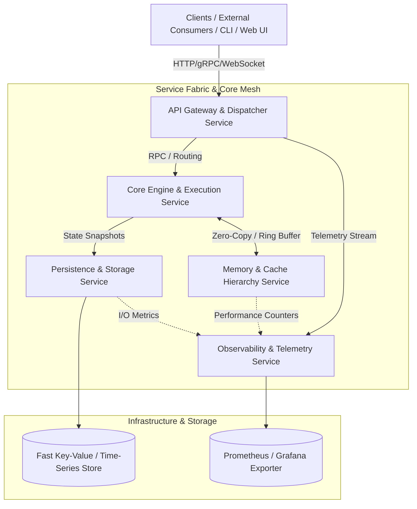

# System Architecture Blueprint: Distributed Engine & Microservices

**Author:** Principal Software Architect  
**Project:** COA Project (High-Performance Engine & Microservices Architecture)  
**Standard:** C++20 / C++23  
**Target Environments:** Linux (x86_64 / ARM64), Windows (MSVC / MinGW-w64)

---

## 1. Executive Summary & Architectural Vision

The **COA Project** is architected as an enterprise-grade, high-performance distributed engine designed around modularity, low-latency execution, zero-copy inter-process communication, and strict memory safety.

The platform decomposes complex state execution, simulation, and telemetry into autonomous microservice modules that can be deployed as:
1. **Monolithic Unified Runtime (In-Process / Shared Memory)**: Optimized for development, debugging, and ultra-low latency.
2. **Distributed Microservice Mesh**: Containerized independent services communicating over gRPC / Protocol Buffers and high-throughput ring buffers.

---

## 2. High-Level System Topology



---

## 3. Microservice Modules Breakdown

### 3.1 API Gateway & Ingress Dispatcher (`services/gateway`)
* **Role**: Single entry point for external interaction, request authentication, rate-limiting, and protocol translation (HTTP/WebSocket to gRPC).
* **Key Responsibilities**:
  * Ingress TLS termination and connection pooling.
  * Validation of incoming payload schemas.
  * Workload dispatching to engine workers with round-robin or load-based routing.
* **Technology**: C++20 coroutines, Boost.Asio or Drogon / Beast HTTP engine.

### 3.2 Core Engine & Execution Service (`services/engine`)
* **Role**: Primary computation and simulation engine handling cycle-accurate operations, instruction pipelines, and control flow orchestration.
* **Key Responsibilities**:
  * Microcode / instruction decode, ALU execution simulation, pipeline hazards resolution (Forwarding, Branch Prediction).
  * State transition evaluation and deterministic tick synchronization.
* **Interface**: High-performance RPC (gRPC) and IPC lock-free ring-buffer channels.

### 3.3 Memory & Cache Controller Service (`services/memory_controller`)
* **Role**: Emulates or manages hierarchical memory architectures, caching subsystems, and bus arbitration.
* **Key Responsibilities**:
  * Multi-level cache simulation (L1i, L1d, unified L2/L3) with configurable associativity, write policies (Write-Back vs Write-Through), and replacement algorithms (LRU, FIFO, LFU).
  * Translation Lookaside Buffer (TLB) and virtual memory paging models.
  * Memory latency simulation, bus contention, and NUMA-aware access policies.

### 3.4 State Persistence & Snapshot Service (`services/persistence`)
* **Role**: Durable state checkpoints, session journal recording, and time-travel replay snapshots.
* **Key Responsibilities**:
  * Append-only Write-Ahead Logging (WAL) for state transitions.
  * Checkpoint serialization (FlatBuffers / Protocol Buffers) enabling instantaneous checkpoint rollback and state diff analysis.
  * Offloading persistence workloads from hot computation paths.

### 3.5 Telemetry & Observability Service (`services/telemetry`)
* **Role**: Central collector for system metrics, execution cycle diagnostics, and distributed tracing.
* **Key Responsibilities**:
  * Cycle statistics: CPI (Cycles Per Instruction), IPC, cache hit/miss ratios, branch misprediction penalty calculations.
  * Real-time metrics streaming over OpenTelemetry (OTel) and Prometheus scraping endpoints.
  * Diagnostic alert generation on anomalies or execution deadlocks.

---

## 4. Inter-Service Communication & IPC Strategy

To meet both distributed requirements and extreme throughput demands, the architecture adopts a hybrid communication tier:

| Communication Channel | Protocol / Technology | Intended Use Case |
| :--- | :--- | :--- |
| **Control Plane & Remote RPC** | **gRPC + Protobuf 3** | Cross-host RPCs, gateway-to-service routing, configuration updates, lifecycle commands. |
| **Local Zero-Copy IPC** | **Shared Memory + Lock-free Ring Buffer (Boost.Interprocess / SPSC)** | Low-latency communication between Core Engine and Memory Controller when co-located. |
| **Telemetry & Event Bus** | **ZeroMQ / NATS / Kafka Pub-Sub** | High-volume metric aggregation, checkpoint events, log propagation. |

---

## 5. Repository Directory Organization Roadmap

```
COA Project/
├── CMakeLists.txt              # Root build configuration
├── architecture_blueprint.md   # Architectural specifications
├── .gitignore                  # Git ignore rules
│
├── include/                    # Public API & Core abstractions
│   └── core/
│       ├── app_config.hpp      # Configuration & versioning
│       ├── types.hpp           # Common typedefs & strong types
│       └── result.hpp          # std::expected / Result monad
│
├── src/                        # Root entrypoints & supervisor
│   └── main.cpp                # Supervisor runtime entrypoint
│
├── proto/                      # Protocol Buffer definitions
│   ├── engine.proto
│   ├── memory.proto
│   └── telemetry.proto
│
├── services/                   # Modular microservices
│   ├── gateway/                # Ingress & API Gateway service
│   ├── engine/                 # Core execution engine
│   ├── memory_controller/      # Cache & memory hierarchy
│   ├── persistence/            # Snapshot & WAL storage
│   └── telemetry/              # Metrics & OTel reporter
│
├── libs/                       # Shared internal libraries
│   ├── ipc/                    # Lock-free ring buffer & shared memory
│   ├── concurrency/            # Thread pools, worker queues, coroutines
│   └── logger/                 # Structured asynchronous logging
│
├── tests/                      # Unit, integration & benchmark tests
│   ├── unit/
│   ├── integration/
│   └── benchmarks/
│
└── deploy/                     # Infrastructure & deployment manifests
    ├── docker/
    │   ├── Dockerfile.engine
    │   └── Dockerfile.gateway
    └── docker-compose.yml
```

---

## 6. Engineering Standards & Modern C++ Conventions

1. **Modern C++ Standard**: Target **C++20** with transition paths to **C++23**.
   * Utilize `std::span`, `std::string_view`, concepts (`requires`), and ranges to eliminate raw pointer hazards.
   * Prefer value semantics and RAII (`std::unique_ptr`, custom resource wrappers) over raw handles.
   * Leverage `std::jthread` for cooperative cancellation and automatic join-on-destruction.
2. **Error Handling**:
   * Critical/Hot paths: Return `std::expected` / outcome error codes; do not throw exceptions in performance-critical loops.
   * Exceptional boundary errors: Structured domain exceptions caught at API/Service boundaries.
3. **Compiler Warnings & Quality**:
   * `-Wall -Wextra -Wpedantic -Wconversion -Wshadow` (GCC/Clang) and `/W4 /permissive-` (MSVC).
   * Static analysis integration: `clang-tidy`, `cppcheck`.
   * Sanitizers enabled in CI debug builds: AddressSanitizer (ASan), UndefinedBehaviorSanitizer (UBSan), ThreadSanitizer (TSan).

---

## 7. Next Implementation Milestones

- [x] **Milestone 0**: Project Scaffolding & Architecture Blueprint.
- [ ] **Milestone 1**: Protocol Buffers / gRPC schema definitions in `proto/`.
- [ ] **Milestone 2**: Shared IPC library (`libs/ipc`) featuring lock-free single-producer single-consumer (SPSC) ring buffer.
- [ ] **Milestone 3**: Core Engine execution module (`services/engine`) skeleton with clock tick abstraction.
- [ ] **Milestone 4**: Cache hierarchy simulator in `services/memory_controller`.
- [ ] **Milestone 5**: Integration testing suite with GoogleTest and benchmark harness.
